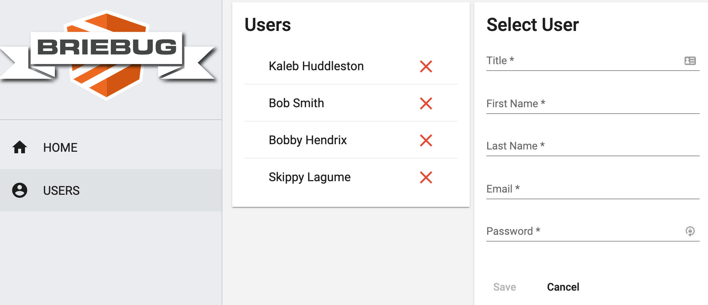

# User Dashboard

This project was generated using [Nx](https://nx.dev).



## App Description

This is the 1st of 8 Accelerated Angular LevelUp Applications.
As the 1st app in this series, it aims to show the baseline requirements for a fully reactive, well architected Angular application.

Specifically, this dashboard app features CRUD functionality on a User entity -

```json
{
  "id": "21789f40-b0fb-4aa6-8e88-376b4edfmnhy",
  "title": "Software Engineer",
  "role": "user",
  "description": "Pending",
  "firstName": "Kaleb",
  "lastName": "Huddleston",
  "email": "kaleb@users.com",
  "password": "insecure"
}
```

## See It Live

[Visit Users Dashboard](https://levelup-angular-01-users.surge.sh/users)

## Getting Started

Run `npm install`.

## Development server

Run `npm run serve:all` for a dev server and to run the json-server api. Navigate to http://localhost:4200/. The app will automatically reload if you change any of the source files.

## Build

Run `ng build dashboard` to build the project. The build artifacts will be stored in the `dist/` directory. Use the `--prod` flag for a production build.

## Understand your workspace

Run `nx dep-graph` to see a diagram of the dependencies of your projects.
